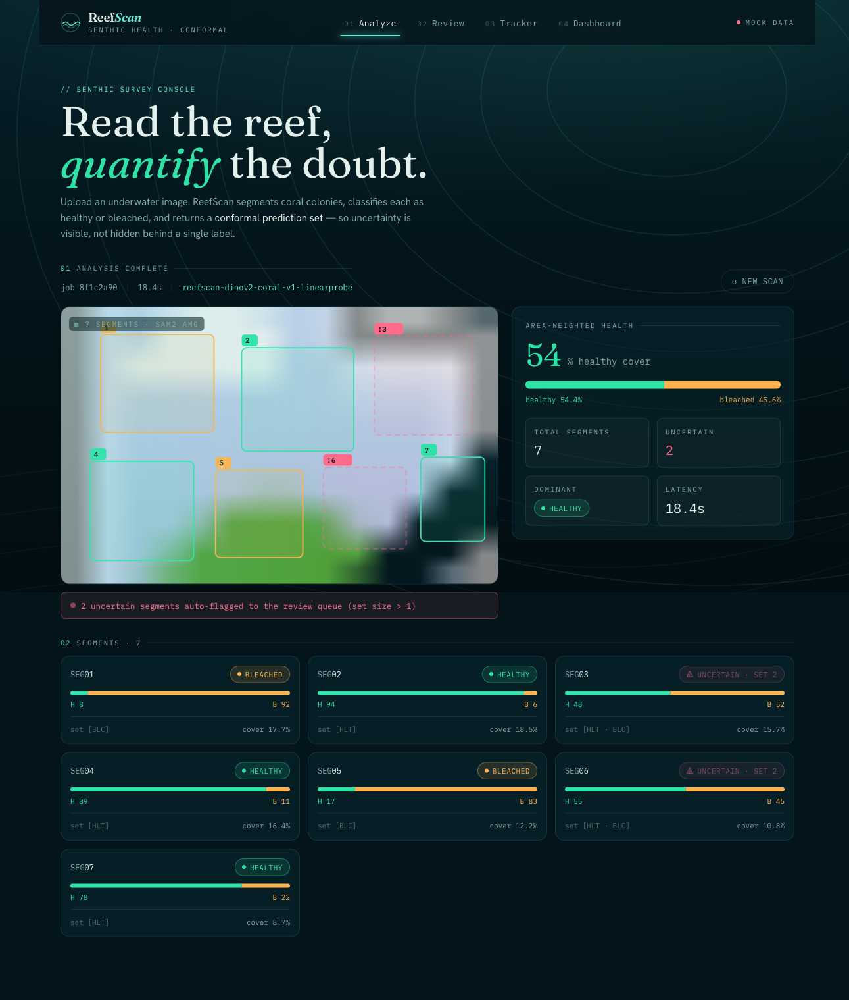
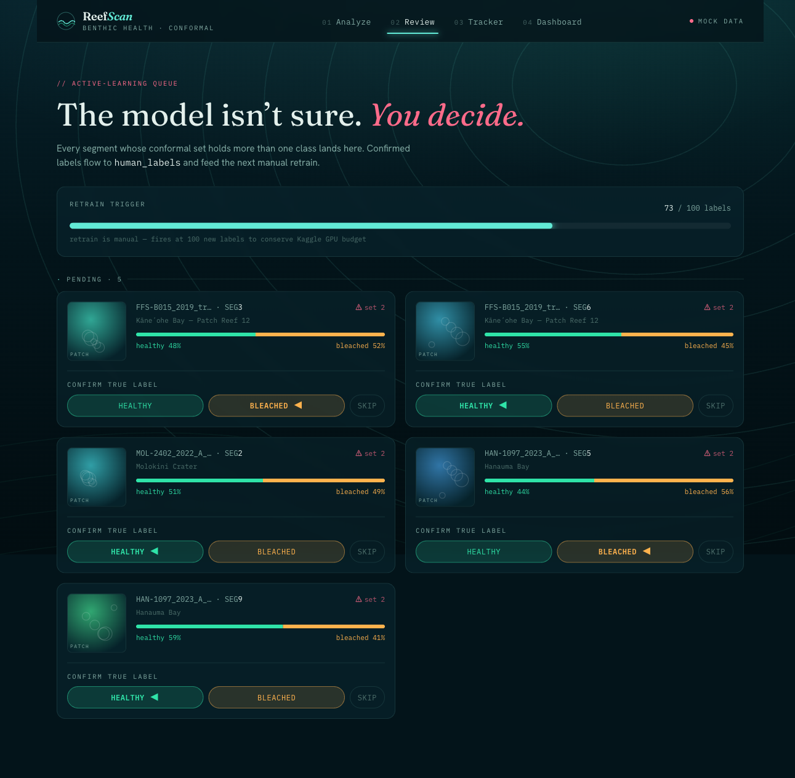
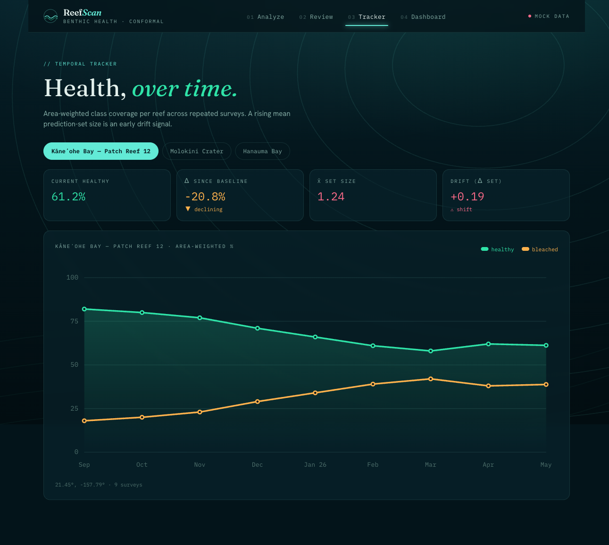
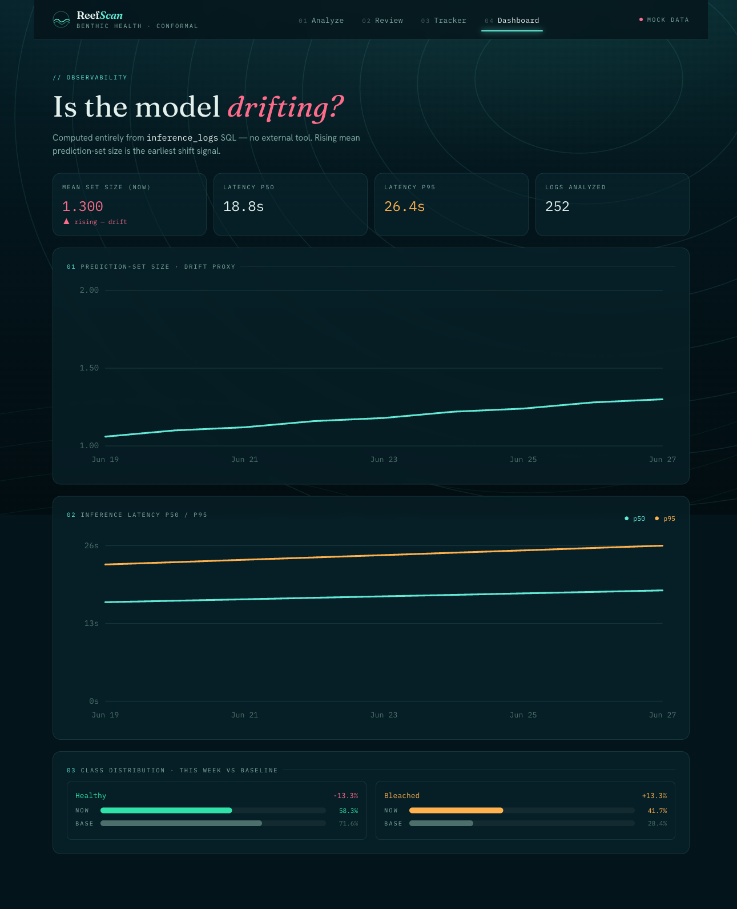

# 🪸 ReefScan

**End-to-end coral reef health analysis with calibrated uncertainty — trained, deployed, and observable, entirely on free-tier infrastructure.**

Upload an underwater photo. ReefScan segments individual coral colonies, classifies each as **healthy** or **bleached**, and wraps every prediction in a **conformal prediction set** with a 90% coverage guarantee — so the model's uncertainty is *visible and actionable*, not hidden behind a single label. Uncertain colonies are routed to a human-review queue that feeds the next round of training (a data flywheel), and every inference is logged to power drift/latency/class-shift dashboards.

| | |
|---|---|
| 🔴 **Live demo** | **https://reefscan.vercel.app** |
| ⚙️ **Inference API** | https://hrishikabra-reefscan-api.hf.space ([`/health`](https://hrishikabra-reefscan-api.hf.space/health)) |
| 🤗 **Model + calibration** | [HrishiKabra/reefscan-dinov2-coral](https://huggingface.co/HrishiKabra/reefscan-dinov2-coral) |
| 📊 **Dataset** | [NOAA-PIFSC-ESD Coral Bleaching](https://huggingface.co/datasets/NMFS-OSI/NOAA-PIFSC-ESD-CORAL-Bleaching-Dataset) |

> ⚠️ **Demo note:** the Supabase free tier auto-pauses after ~1 week of inactivity and the Hugging Face Space cold-starts (it downloads ~0.7 GB of weights on first hit). A slow first load is expected, not a bug. Because SAM2 runs on a free 2-vCPU CPU, a single image takes ~45 s — which is exactly why inference is an **async job**, surfaced in the UI as a live "pipeline running" state.

---

## What it looks like

**Analyze** — drop an image, get an annotated overlay (teal = healthy, amber = bleached, pulsing pink = *uncertain*), per-segment conformal sets, and an area-weighted health summary:



| Review queue (active learning) | Temporal tracker | Observability dashboard |
|---|---|---|
|  |  |  |

---

## Architecture

```
                 ┌─────────────────────── Hugging Face Space (FastAPI, free CPU) ───────────────────────┐
  image/video ──>│  POST /infer ─► async job  ─►  WaterNet enhance ─► PySceneDetect (video) / passthrough │
                 │                                 │                                                       │
   poll ◄────────│  GET /infer/{id}                ▼                                                       │
                 │                          SAM2 Hiera-S (Automatic Mask Generator, pps=16 @ 512px)        │
                 │                                 │   per mask: bbox crop ─► 224² ─► ImageNet norm         │
                 │                                 ▼                                                       │
                 │                          DINOv2-B classifier ─► softmax ─► split-conformal (LAC, 90%)    │
                 │                                 │                                                       │
                 │   Supabase (Postgres+Storage) ◄─┴─► inference_logs · review_queue · health_snapshots     │
                 └───────────────────────────────────────────────────────────────────────────────────────┘
                                                   ▲
   Next.js 14 (Vercel) ── Analyze · Review · Tracker · Dashboard ──────────┘   (one swap point: lib/api.ts)
```

**Stack:** FastAPI · Next.js 14 / TypeScript / Tailwind · Supabase (Postgres + Storage) · Hugging Face Spaces (Docker, free CPU) · Vercel · Weights & Biases · Kaggle/Colab for training.

---

## Results

Trained on the NOAA-PIFSC-ESD bleaching dataset (10,419 pre-cropped colony patches; native site/year-controlled train/val/test splits; ~62% healthy / 38% bleached). DINOv2-B backbone, evaluated on the held-out test split (1,565 images).

| stage | test accuracy | macro-F1 | conformal coverage* | avg. set size |
|---|---:|---:|---:|---:|
| Linear probe (frozen backbone, 1,538-param head) | 0.857 | 0.846 | 0.914 | 1.120 |
| **Full fine-tune** (last 2 blocks + head) | **0.895** | **0.887** | 0.923 | 1.075 |

\* Empirical coverage on the test split for a 90% target — the conformal guarantee holds (split conformal is designed to be slightly conservative). The fine-tune is more confident: average prediction-set size drops to **1.075**, i.e. ~92% of colonies get a single confident label and only ~8% are flagged uncertain.

The deployed Space serves the fine-tune model.

---

## Design decisions (the interesting part)

Every choice below was made deliberately and, where it mattered, **measured** before committing.

### 1. DINOv2-B over a supervised ViT
Self-supervised DINOv2 features transfer strongly with a *linear probe* — an 85.7% / 0.846-F1 baseline with a **1,538-parameter head** and a frozen backbone, before any fine-tuning. That's a clean, cheap, defensible baseline and a natural ablation against the full fine-tune.

### 2. SAM2 Automatic Mask Generator — no trained detection head
The pipeline auto-segments colonies with SAM2-Hiera-Small's **Automatic Mask Generator** (a grid of point prompts) — no manual clicks and, deliberately, **no trained detection head** (the dataset has image-level labels, not boxes, so there's nothing to train a detector on). A learned detector is documented future work, not a hidden dependency.

### 3. Conformal prediction (split conformal, LAC) — sets, not point labels
Instead of emitting a bare argmax, each colony gets a **prediction set** calibrated to cover the true class 90% of the time. A set of size 1 = confident; size 2 (`{healthy, bleached}`) = the model is genuinely unsure. This single signal drives the whole MLOps loop: uncertain colonies are flagged in the UI, written to `review_queue`, and the rolling mean set-size is a free **drift detector**. Implemented as hand-rolled LAC (`qhat` = quantile of `1 − p_true` on a held-out calibration split) — transparent and ~15 lines, calibrated on the 1,562-image val split, realized coverage 0.91–0.92 on test.

### 4. The train→inference bridge
Training data is whole-image colony patches; inference classifies SAM2 mask crops. These are reconciled on purpose: **train on the whole patch (resize 224 + ImageNet norm); at inference, crop the mask's bounding box and apply the identical tail.** Because the training distribution (colony-level crops) closely matches what mask bboxes produce, train and inference domains align *by construction* — a tighter match than point-centered crops would give.

### 5. WaterNet over CLAHE
Underwater images suffer wavelength-dependent color loss that simple histogram equalization (CLAHE) can't model. WaterNet is a learned restoration network; it's wired as a pipeline stage (currently identity-passthrough, real weights are vendored as a follow-up) so the enhancement seam exists without blocking the rest.

### 6. 2 classes, not 4 — driven by EDA
The original spec assumed a 4-class CoralNet taxonomy. EDA of the actual NOAA dataset showed only two health states (`CORAL` → healthy, `CORAL_BL` → bleached) — so the model, UI, and conformal sets run **2-class**. `dead` and `algae_covered` stay reserved in the Postgres enum so a future extension needs **no migration**.

### 7. Async inference — forced by a feasibility spike
Before building, a Phase-1.5 spike measured the real pipeline on CPU: **both models resident fit in ~0.9 GB RAM** (so no lazy-loading needed), but SAM2's AMG is the latency bottleneck (~6 s locally → ~45 s on the free Space). A sweep locked the AMG config at **`points_per_side=16` @ 512 px** (the knee of the quality/latency curve). The ~45 s/image reality is *why* `POST /infer` enqueues a job and returns immediately, and the client polls — images and video share one async path.

### 8. Free-tier infrastructure, chosen on constraints
- **Hugging Face Spaces over Render** — Render's free tier (512 MB) can't hold SAM2 + DINOv2; the Space's 16 GB CPU fits comfortably (the spike confirmed ~0.9 GB).
- **Supabase Storage over Cloudflare R2** — reuses the existing Supabase project (one fewer account); the backend still supports R2 by setting four env vars.
- **RLS-locked Supabase** — tables have row-level security enabled with no policies, so the public anon key is denied; only the backend's server-side `service_role` key (which bypasses RLS) can read/write. The frontend never holds a Supabase key.

---

## MLOps

This is a *system*, not just a model.

- **Reproducible training** (`notebooks/01_train_dinov2.ipynb`): one-shot Colab/Kaggle notebook that loads the dataset via its **parquet shards** (4 files vs. 10,419 PNGs — minutes, not hours), checkpoints every epoch, **resumes from the latest checkpoint** across session deaths, logs to W&B, and pushes weights + `conformal.json` to the Hub — all in a single cell so nothing is left to a forgotten manual step.
- **Active-learning flywheel**: conformal set size > 1 → `review_queue` → human confirms in `/admin/review` → `human_labels`. Retraining is **manual** (triggered at 100 new labels) to conserve GPU budget — never auto-wired.
- **Observability from raw SQL** (`/dashboard`): rolling mean prediction-set size (drift proxy), inference latency p50/p95, and class-distribution shift (this week vs. baseline) — all computed from `inference_logs`, no external observability tool.
- **Resilient logging**: the Supabase (httpx) client is shared across the event loop and the inference worker thread; on the deployed box this intermittently dropped writes (diagnosed via Postgres logs as client-side, not DB-side). Fixed with a serialize-lock + retry (`persistence._sb_call`) — the kind of production hardening that only shows up once something's actually deployed.
- **Graceful degradation**: with no weights, the API serves contract-valid *stub* output; with no Supabase/Storage, logging/storage no-op. The frontend falls back to mock data when `NEXT_PUBLIC_REEFSCAN_API` is unset — so every layer runs standalone for development.

---

## Repo layout

```
reefscan/
├── backend/
│   ├── main.py              FastAPI: POST /infer, GET /infer/{id}, /health, review/tracker/observability
│   ├── schemas.py           frozen response contract (mirrors frontend/lib/types.ts)
│   ├── jobs.py              async job store + worker (pipeline in a threadpool)
│   ├── persistence.py       Supabase logging + object storage (resilient, no-op fallbacks)
│   ├── observability.py     inference_logs → drift / latency / class-shift aggregations
│   ├── inference/           enhancer · frame_extractor · segmenter (SAM2) · classifier (DINOv2+conformal) · pipeline
│   ├── data/                CoralPatchDataset (imagefolder) · transforms · EDA · label mapping
│   ├── db/                  schema.sql · seed_demo.sql
│   └── tests/               pytest (async contract + observability)
├── frontend/                Next.js 14 — app/{page,admin/review,tracker,dashboard} · lib/api.ts (swap point)
├── notebooks/01_train_dinov2.ipynb   one-shot Colab/Kaggle trainer + conformal calibration
├── deploy/                  Dockerfile + HF Space README
└── CLAUDE.md                full decision log / build journal
```

---

## Run it locally

**Backend** (Python 3.11+):
```bash
cd backend
pip install --extra-index-url https://download.pytorch.org/whl/cpu -r requirements.txt
pip install "git+https://github.com/facebookresearch/sam2.git"          # SAM2 (no PyPI release)
# from repo root, with a .env (see .env.example):
REEFSCAN_STUB=1 uvicorn backend.main:app --reload                        # stub mode = no weights needed
pytest backend/tests/                                                    # 10 tests
```

**Frontend** (Node 18+):
```bash
cd frontend && npm install
# point at the live API, or omit to use built-in mock data:
echo 'NEXT_PUBLIC_REEFSCAN_API=https://hrishikabra-reefscan-api.hf.space' > .env.local
npm run dev
```

**Train** — open `notebooks/01_train_dinov2.ipynb` in Colab/Kaggle (GPU), set `WANDB_KEY` + `HF_TOKEN`, Run all.

**Database** — run `backend/db/schema.sql` then `backend/db/seed_demo.sql` in the Supabase SQL editor.

---

## Limitations & future work
- **Latency**: SAM2 AMG on free CPU is ~45 s/image. Path forward: ONNX-export + quantize the SAM2 image encoder (the measured bottleneck — *not* DINOv2, which is ~166 ms/patch).
- **WaterNet** is currently an identity passthrough; vendoring real pretrained weights is the next enhancement.
- **2 classes** until a `dead`/`algae_covered`-bearing source (e.g. ReefNet) is added — the schema already supports it.
- **Trained detection head** for SAM2 prompting (vs. the grid AMG) is documented future work.
- ReefScan is also intended as the **specialist baseline** in a future VLM coral-benchmark paper.

## Acknowledgements
Dataset: **NMFS-OSI / NOAA-PIFSC-ESD Coral Bleaching Dataset**. Models: Meta AI's **DINOv2** and **SAM2**. Built on free tiers from Hugging Face, Supabase, Vercel, Kaggle, and Weights & Biases.
