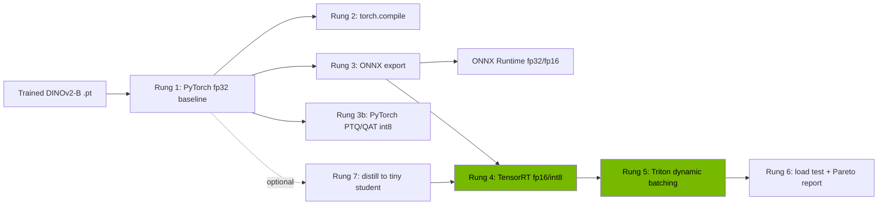

# ReefScan-Edge — v2 Inference Optimization Spec

**Goal:** take the *already-trained* DINOv2-B coral classifier and make it fast — producing the systems-performance metrics (latency, throughput, accuracy-vs-speed trade-off) that Apple/Meta/NVIDIA/Google explicitly ask for and that no current ReefScan artifact provides.

**The one rule:** every variant is benchmarked on the **same 1,565-image held-out test set** so accuracy comparisons are apples-to-apples, and every latency number uses proper GPU warmup + sync.

**Gaps closed:** efficient inference · quantization · TensorRT/Triton · model serving under load · performance profiling · (optional) C++ runtime + CoreML edge.

---

## 0. Prerequisites

- The trained DINOv2-B checkpoint (`.pt`) + the preprocessing transform.
- The held-out test set (1,565 images) with labels.
- A small **calibration set** (~300–500 representative images, can be a train subset) for int8.
- An NVIDIA GPU for the TensorRT/Triton rungs (a free T4 on Kaggle/Colab is sufficient — see Costs).

---

## 1. Architecture — the optimization ladder



Each rung produces one row in the benchmark table. The green rungs are the NVIDIA-aligned signal.

---

## 2. Rung-by-rung

### Rung 1 — Baseline (the control)
Measure correctly or every later number is meaningless.

```python
import torch, time, numpy as np

@torch.no_grad()
def bench(model, x, warmup=20, iters=200):
    model.eval()
    for _ in range(warmup):           # warmup
        model(x); torch.cuda.synchronize()
    lat = []
    for _ in range(iters):
        torch.cuda.synchronize(); t0 = time.perf_counter()
        model(x)
        torch.cuda.synchronize(); lat.append((time.perf_counter()-t0)*1e3)
    lat = np.array(lat)
    return {"p50": np.percentile(lat,50), "p95": np.percentile(lat,95),
            "p99": np.percentile(lat,99), "throughput_ips": x.shape[0]*1000/lat.mean(),
            "mem_mb": torch.cuda.max_memory_allocated()/1e6}
```
Log: p50/p95/p99 latency, throughput at batch 1 and 32, peak GPU memory, and **macro-F1 on the test set**.

### Rung 2 — `torch.compile`
```python
fast = torch.compile(model, mode="max-autotune")
```
Re-benchmark. Usually a free 1.3–2× with zero accuracy change. Cheapest win.

### Rung 3 — ONNX export + ONNX Runtime
```python
torch.onnx.export(model, dummy, "reefscan.onnx", opset_version=17,
    input_names=["input"], output_names=["logits"],
    dynamic_axes={"input": {0: "batch"}, "logits": {0: "batch"}})
```
Run under `onnxruntime-gpu` (CUDA + TensorRT execution providers) and on CPU (for the edge story). Cross-runtime numbers matter.

### Rung 3b — Quantization (the trade-off curve)
- **fp16:** near-free 2× on tensor-core GPUs, usually <0.1 pt accuracy loss.
- **int8 PTQ:** post-training, needs the calibration set. ViTs are sensitive — expect a real accuracy hit. *This is the point:* document it.
- **int8 QAT (deep cut):** fine-tune with fake-quant to recover most of the lost accuracy. Optional, but it's the rung that signals depth.

The deliverable here is a plot: **macro-F1 vs latency** for {fp32, fp16, int8-PTQ, int8-QAT}. That curve is the most valuable single artifact in the project.

### Rung 4 — TensorRT (the NVIDIA flex)
Build engines from the ONNX:
```bash
# fp16
trtexec --onnx=reefscan.onnx --fp16 --saveEngine=reefscan_fp16.plan \
        --minShapes=input:1x3x224x224 --optShapes=input:8x3x224x224 --maxShapes=input:32x3x224x224
# int8 (needs a calibrator; use the Python API with IInt8EntropyCalibrator2 over the calibration set)
```
Benchmark the `.plan` engines. Report the headline: *fp32 PyTorch → int8 TensorRT* speedup with the accuracy delta.

### Rung 5 — Serving with Triton + dynamic batching
Model repository:
```
models/reefscan/
  config.pbtxt
  1/model.plan
```
```protobuf
# config.pbtxt
platform: "tensorrt_plan"
max_batch_size: 32
dynamic_batching { preferred_batch_size: [8, 16, 32]  max_queue_delay_microseconds: 2000 }
instance_group [{ count: 2  kind: KIND_GPU }]
```
Serve: `tritonserver --model-repository=models`.

### Rung 6 — Load test + Pareto report
Use Triton's native `perf_analyzer` (strong NVIDIA signal) and/or `model_analyzer`:
```bash
perf_analyzer -m reefscan --concurrency-range 1:16:2 --percentile=95
```
Report throughput vs concurrency, p95 under load, and **cost per 1k inferences** (GPU $/hr ÷ throughput). If you wrap Triton behind FastAPI, add a `locust` HTTP load test for the end-to-end number.

### Rung 7 — Distillation (optional, ties to your "small specialist" theme)
Distill DINOv2-B → a small student (DINOv2-S or a compact CNN) with KL-divergence on soft logits. Add the student to the Pareto frontier. This is the most research-flavored rung and the strongest single bullet if it lands.

### Profiling rung (senior touch, ~2 hrs)
Run the PyTorch profiler / Nsight Systems on the baseline and show **where the latency goes** (attention vs MLP vs preprocessing). "I profiled, found X was the bottleneck, and targeted it" is a senior narrative most candidates can't tell.

### Optional cross-platform rungs
- **CoreML** (`coremltools`): export, run on Apple Silicon, report Neural Engine latency — the Apple signal.
- **C++ TensorRT runtime**: a minimal C++ binary loading the `.plan` and running inference — the NVIDIA C/C++ signal.

---

## 3. Benchmark harness (the centerpiece)

One reproducible script sweeping **{runtime × precision × batch size}** → a single results table + plots.

| runtime | precision | batch | p50 ms | p95 ms | throughput img/s | peak mem MB | macro-F1 |
|---|---|---|---|---|---|---|---|
| pytorch | fp32 | 1 | … | … | … | … | … |
| pytorch | fp32 | 32 | … | … | … | … | … |
| torch.compile | fp32 | 1 | … | … | … | … | … |
| onnxruntime | fp16 | 32 | … | … | … | … | … |
| tensorrt | fp16 | 32 | … | … | … | … | … |
| tensorrt | int8 | 32 | … | … | … | … | … |
| tensorrt (distilled) | int8 | 32 | … | … | … | … | … |

Outputs:
1. The table above (CSV + README markdown).
2. **Pareto frontier plot:** macro-F1 (y) vs p95 latency (x), every variant a point, frontier highlighted.
3. Throughput-vs-concurrency plot from `perf_analyzer`.

Pin versions (CUDA, TensorRT, torch, onnxruntime) in the README — reproducibility is part of the grade.

---

## 4. Infra

`docker-compose.yml`: a `triton` service (`nvcr.io/nvidia/tritonserver:<tag>-py3`, GPU-enabled) + an optional `api` (FastAPI proxy) + a `loadtest` (locust). Benchmark scripts run in the NGC PyTorch container (`nvcr.io/nvidia/pytorch:<tag>`) so TensorRT/CUDA versions are consistent. Everything pinned.

---

## 5. Costs

**Cash: $0 on the free path; ~$5–25 on cheap cloud.** TensorRT int8 + fp16 both run on a free T4, so the whole core project is doable for nothing.

| Item | Free path | Cheap cloud | Notes |
|---|---|---|---|
| GPU, core ladder (~10–15 GPU-hr) | Kaggle (30 GPU-hr/wk free) or Colab free T4 | RunPod / Vast.ai spot T4 or RTX 3090 @ ~$0.20–0.45/hr → **$3–7** | TensorRT needs an NVIDIA GPU; T4 has int8 + fp16 tensor cores |
| Distillation rung (+10–20 GPU-hr) | Kaggle/Colab (slower, session limits) | +**$4–9** spot | optional |
| Triton serving + load test (+2–3 hr) | same GPU session | included | `perf_analyzer` is free |
| Software (TensorRT, Triton, ONNX RT, Locust, torch) | $0 | $0 | all open source |
| Storage / egress | $0 | ~$0 | artifacts < 1 GB |
| CoreML / CPU-edge rungs | $0 (your Mac/laptop) | — | optional |
| **Total cash** | **$0** | **~$5–25** | |
| **Time** | **~2 weekends core; +1 for distillation** | same | the real cost |

**Notes & free credits:**
- Free path works end-to-end but Colab/Kaggle sessions time out and reset — cloud spot (~$5–10) buys uninterrupted control and is worth it for the TensorRT/Triton rungs.
- Avoid DigitalOcean GPU droplets here — they're ~$1.5–3+/hr (L40S/H100), overkill and pricier than spot T4/3090.
- Tap credits you may already have: GitHub Student Developer Pack, NVIDIA Developer Program (free TensorRT/Triton + DLI), and any AWS/GCP/Azure student credits. These cover the cloud rungs outright.
- No LLM/API spend in this project — it's pure inference on your own model, which is why it's nearly free.

---

## 6. Phased plan (~2 weekends, don't build this and the F1 upgrade at once)

**Weekend 1 — get the curve:**
1. Rung 1 baseline harness (correct warmup/sync) + accuracy on test set.
2. Rungs 2–3: torch.compile, ONNX export, ONNX Runtime fp16.
3. Rung 3b: fp16 + int8 PTQ → first accuracy-vs-latency plot.
→ Already produces a real "Nx speedup, M-pt accuracy delta" bullet.

**Weekend 2 — make it production + NVIDIA-grade:**
4. Rung 4: TensorRT fp16 + int8 (calibrator).
5. Rung 5–6: Triton dynamic batching, `perf_analyzer` load test, cost-per-1k.
6. Profiling rung + finalize the Pareto report and README.
→ Closes serving, TensorRT/Triton, profiling.

**Optional Weekend 3:** distillation rung and/or CoreML + C++ runtime.

---

## 7. Resume payoff (templates — fill with your real numbers)

- *"Cut p95 inference latency ⟨4.2×⟩ (⟨38 → 9 ms⟩) on DINOv2-B coral classification via int8 TensorRT with ⟨<1 pt⟩ macro-F1 loss, mapping the full accuracy–latency frontier across 5 runtimes (PyTorch, torch.compile, ONNX Runtime, TensorRT fp16/int8)."*
- *"Served the model with NVIDIA Triton dynamic batching (Docker), sustaining ⟨X⟩ img/s at ⟨N⟩-way concurrency at ⟨$Y⟩/1k inferences; profiled with Nsight to target the ⟨attention⟩ bottleneck."*
- *(if distilled)* *"Distilled DINOv2-B into a ⟨k×⟩-smaller student retaining ⟨Z%⟩ of macro-F1 at ⟨m×⟩ lower latency."*

That first bullet is verbatim the format NVIDIA's recruiting VP said they look for.

## 8. Company keyword map

| Company | What this project hits |
|---|---|
| **NVIDIA** | TensorRT, Triton, int8/fp16 quantization, `perf_analyzer`, latency/throughput metrics, optional CUDA/C++ runtime, profiling |
| **Apple** | on-device quantization, CoreML export, latency budgets, model efficiency, full lifecycle |
| **Meta** | efficient/scalable serving, dynamic batching under load, optimization with metrics |
| **Google** | systems performance, reproducible benchmarking, distributed-ish serving |

## 9. Pitfalls (don't let these invalidate the numbers)

- **No warmup / no `cuda.synchronize()`** → latency numbers are garbage. The harness above handles it.
- **Different test set per variant** → trade-off curve is meaningless. Always the same 1,565 images.
- **int8 without representative calibration** → accuracy cratering you'll wrongly blame on TensorRT.
- **Reporting batch-1 throughput as your headline** → batching is where throughput lives; report both and be explicit which is which.
- **Version drift** → a TensorRT/CUDA mismatch wastes hours; use the NGC containers and pin everything.