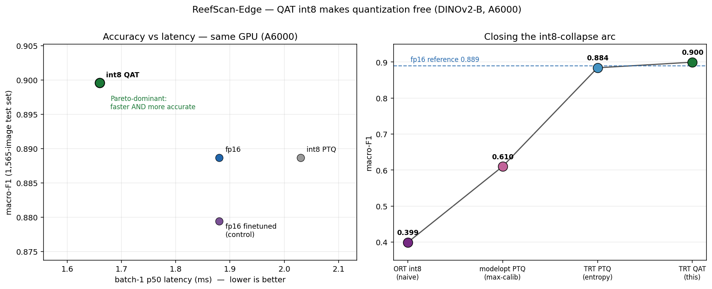

# ReefScan-Edge — an inference-optimization & serving portfolio

> The v2 layer over ReefScan. v1 trained a DINOv2-B coral-health classifier (test macro-F1 0.887,
> conformal-calibrated, deployed). v2 asks the next question a real ML team asks: **now make it fast,
> serve it properly, and know exactly what every trade-off costs.** This is that work — an
> optimization ladder, a serving layer I wrote in C++, a head-to-head against production Triton, and a
> quantization study that closes an honest negative from v1.
>
> The point is **defensible ML-systems engineering**, not a headline number. Every claim below is
> measured on the same 1,565-image held-out test set, every win is traced to a cause, and the
> negatives are kept in.

---

## The through-line: one harness, enforced invariants, honest negatives

Everything hangs off `harness.py` — `benchmark(name, runtime, precision, predict_fn, …)`. Each new
variant registers a `(runtime, precision, batch)` and inherits the same discipline:

1. **Same 1,565-image test set** for every variant (macro-F1 is comparable across the board).
2. **Latency = warmup + `cuda.synchronize`-bracketed** timing (device-aware).
3. **Batch-1 and batched are separate rows** — never conflated.
4. **int8 calibration is representative** (`data.load_calibration()`, a strided train subsample — not random).

Results are append-by-replace into `results.csv` → `RESULTS.md`. Re-running a rung overwrites its
rows; it never duplicates. That single spine is what lets a PyTorch-CPU row, a hand-written C++
server, and a QAT int8 engine sit in one honest table.

---

## Part 1 — The optimization ladder (map the accuracy–latency frontier)

PyTorch → torch.compile → ONNX Runtime → TensorRT fp16/int8, on an L4.

| stage | batch-1 p95 | batched img/s | macro-F1 | the lesson |
|---|---:|---:|---:|---|
| PyTorch fp32 (CPU) | 161 ms | 8 | 0.887 | the starting point |
| PyTorch fp32 (L4) | 10.0 ms | 128 | 0.885 | GPU, but tensor cores idle (TF32 off) |
| torch.compile | 9.1 ms | 140 | 0.885 | launch-bound win |
| ONNX Runtime fp16 | 3.1 ms | 491 | 0.886 | tensor cores, lossless |
| **TensorRT fp16** | **2.3 ms** | **~920** | **0.887** | **champion — fused + autotuned** |
| TensorRT int8 (PTQ) | 2.4 ms | ~900 | 0.884 | recovers the collapse, but dominated by fp16 on Ada |
| ONNX Runtime int8 (naive) | — | — | **0.399** | static PTQ **collapses** (kept as a negative) |

**TensorRT fp16 wins on both axes at zero accuracy cost — 63× over CPU, 4.3× over the PyTorch-GPU
baseline.** Two findings I'm prouder of than the champion:

- **A control experiment corrected my own guess.** ORT-fp32 looked faster than PyTorch-fp32; I
  suspected ONNX graph fusion. A TF32 toggle proved ~all of it was **TF32 tensor cores** (ORT enables
  them by default; PyTorch eager defaults them off) — not fusion. TF32 didn't move accuracy, so the
  tiny ORT accuracy nudge is fused-kernel numerics, a separate effect.
- **Naive int8 collapses this ViT to 0.399** (≈ majority class) — DINOv2's heavy-tailed activation
  outliers get squashed by static per-tensor calibration. That negative is the seed of Part 4.

Serving economics (batch sweep): throughput peaks **954 img/s @ batch 16**, then *backward-bends*
(32/64 are worse on both axes); cheapest point **$0.23 / million inferences**. Details + Pareto/serving
plots: [`README.md`](README.md), [`docs/pareto.png`](docs/pareto.png).

---

## Part 2 — A C++/TensorRT serving layer, hand-written

The ladder is real ML-systems work, but every line of "C++" in it was a `load_inline` string in a
notebook, and the batching was a declarative Triton `.pbtxt`. **[`cpp_server/`](cpp_server/) fills the
one genuine gap: compiled-language concurrency and a latency-critical C++/CUDA path I own end to end.**

- **The TensorRT C++ runtime path** (`trt_engine.cpp`): `IRuntime` → `deserializeCudaEngine` → one
  `IExecutionContext`, pinned host buffers, a CUDA stream, async H2D/`enqueueV3`/D2H. pImpl hides
  `<NvInfer.h>` from the rest of the code; buffers allocated once for `max=64`, never per-request.
- **A hand-written dynamic-batching scheduler** (`batch_queue.cpp`) — the SWE-systems centerpiece. A
  bounded MPMC queue (mutex + two condvars → backpressure); **one scheduler thread owns the engine**
  (the context isn't thread-safe, so exactly one thread ever calls `infer()`); it drains up to
  `MAX_BATCH` **or** until `MAX_DELAY_US` since the batch's first request — literally re-implementing
  Triton's `preferred_batch_size` + `max_queue_delay_microseconds`, by hand. `promise`/`future` hands
  each result back to its caller.
- **The war story: a ~40 ms latency floor that wasn't the model.** The first load client showed a flat
  ~48 ms p50 *independent of load* — the tell-tale signature of **Nagle's algorithm × delayed-ACK**
  (the server's tiny logits response held by Nagle, the peer's ~40 ms delayed-ACK timer firing first).
  `TCP_NODELAY` on both sockets: **48 ms → 3.6 ms p50 (13×), ~1.35k req/s.** Reading the *shape* of the
  curve (flat regardless of concurrency) is what surfaced it — not profiling the model.

Correctness gated the whole thing: logit parity vs the Python-TRT path (atol 1e-3), F1 parity with the
`tensorrt fp16` engine, a promoted fused CUDA preproc kernel with an allclose build-gate. Rationale for
every non-obvious call: [`cpp_server/DECISIONS.md`](cpp_server/DECISIONS.md).

---

## Part 3 — Head-to-head against production Triton (the honest way)

Then I stood up **stock NVIDIA Triton 2.51.0** (`tensorrt_plan` + `dynamic_batching`) on the **same
A6000**, serving the **same fp16 engine**, and load-tested it with the official **`perf_analyzer`**
(native C++ gRPC client — so it's a fair native-client-vs-native-client comparison). F1 parity holds
(0.888), so the comparison is purely about the serving stack.

| conc | cpp-trt p50 | cpp-trt img/s | triton p50 | triton img/s |
|---:|---:|---:|---:|---:|
| 1  | **3.6 ms** | **274** | 5.0 ms | 199 |
| 32 | 26 ms | 1240 | **21 ms** | **1490** |
| 64 | — | — | 37 ms | **~1679** |

**The honest crossover:** my hand-written server **wins at concurrency-1** (no gRPC framing, no forced
queue-delay wait), Triton **wins under load** (its mature dynamic batcher amortizes better and keeps
climbing). I did **not** tune for a vanity win — perf_analyzer's server-side breakdown even decomposes
Triton's 5 ms at conc-1 into **~2.2 ms fp16 kernel + ~1.2 ms queue-delay + ~1.1 ms gRPC**. Knowing
*why* you lose the tail is the signal, not the win. Full 1→64 curve:
[`serving/docs/perf_analyzer.csv`](serving/docs/perf_analyzer.csv); reproduce hands-off on RunPod:
[`serving/tools/`](serving/tools/).

---

## Part 4 — QAT int8: closing the collapse (and correcting a GPU confound)

Part 1 left an open question: naive int8 collapses (0.399); TRT's entropy calibrator recovers it
(0.884) but fp16 dominates it on Ada. **Is that residual gap a calibration ceiling or a training one?**
Quantization-Aware Training answers it. Using **NVIDIA TensorRT Model Optimizer** (`modelopt`): insert
222 fake-quant (Q/DQ) nodes into DINOv2-B, fine-tune 3 epochs, export a QDQ ONNX, build a TRT int8
engine (explicit quantization — no calibrator). [`run_qat.py`](run_qat.py).

**The int8 arc, now closed end to end:**

| method | macro-F1 | what it shows |
|---|---:|---|
| ORT static int8 (naive) | 0.399 | collapse — ViT activation outliers |
| modelopt PTQ (max-calib) | 0.610 | outliers blow up the range (calibrated amax up to **117**) |
| TRT PTQ (entropy calib) | 0.884 | smart calibration recovers most of it |
| **TRT QAT int8** | **0.900** | **best macro-F1 of the entire ladder** |

**I caught a GPU confound before it became a false claim.** The ladder's fp16/int8 rows are L4; QAT
ran on A6000. macro-F1 is GPU-independent (so 0.900 is a fair cross-variant number), but *speed* is
not — so I measured fp16 and PTQ-int8 on the **same A6000** for a fair panel:

| A6000 | batch-1 p50 | batched img/s | macro-F1 |
|---|---:|---:|---:|
| fp16 | 1.88 ms | 1712 | 0.889 |
| int8 PTQ (entropy) | 2.03 ms | 1744 | 0.889 |
| **int8 QAT** | **1.66 ms** | **2022** | **0.900** |

**QAT int8 is Pareto-dominant** — faster *and* more accurate than both fp16 and PTQ-int8. The mechanism
is the interesting part: **PTQ int8 wins no speed over fp16** (TRT leaves the outlier-heavy layers in
fp16, so few matmuls actually run int8), but **QAT's explicit Q/DQ nodes let TRT commit every matmul to
int8 tensor cores** — ~15-18% faster.

**I ran the control that a skeptic would ask for.** QAT is *also* 3 epochs of extra fine-tuning — so is
the accuracy just from more training? [`run_ft_control.py`](run_ft_control.py) fine-tunes the fp model
with the **identical** recipe and **no** quantization: it reaches only **0.879** — it *overfits*, landing
*below* the 0.885 checkpoint. So QAT's **0.900 is +0.020 over the fp-finetuned control** and is **not**
attributable to the extra epochs; the fake-quant noise acted as a regularizer. The honest bound: these
are single-seed runs and ~0.01–0.02 F1 on an imbalanced 2-class set carries variance, so the robust
claim is **"int8 costs no accuracy here, and the QAT gain is not just more training"** — not a
universal "int8 beats fp16." Panel + history: [`docs/qat_speed_a6000.json`](docs/qat_speed_a6000.json),
[`docs/qat_history.json`](docs/qat_history.json), [`docs/qat_control.json`](docs/qat_control.json).

---

## What makes this defensible, not just fast

- **Honest negatives are first-class, not hidden:** the int8 collapse (0.399), fp16 dominating PTQ-int8
  on Ada, the C++ server *losing* to Triton under load, naive int8-quantizing DINOv2 regressing.
- **Every win is traced to a cause:** TF32 vs fusion isolated by a control; the Nagle floor found by
  the curve's *shape*; QAT's speed win explained by Q/DQ committing matmuls to int8.
- **I run the control a skeptic would ask for:** the TF32-vs-fusion isolation, the L4↔A6000 speed
  confound measured away, and a no-quantization fine-tune that proved QAT's gain isn't just extra
  epochs — each an experiment, not an assertion.
- **Reproducibility is wired, not aspirational:** every GPU result is driven hands-off on RunPod
  (deploy → SSH → run → **terminate**), with the box (A6000), TRT version (10.5), and pins recorded in
  every result row and script. Self-carrying `†`/`‡` caveats travel with the table so a number can
  never be quoted out of context.

---

## Résumé bullets (measured, specific)

- **Built a TensorRT inference-optimization ladder** (PyTorch → torch.compile → ONNX Runtime →
  TensorRT fp16/int8) for a DINOv2-B classifier on one benchmark harness with enforced invariants;
  **TensorRT fp16 hit 2.3 ms p95 / ~920 img/s — 63× over CPU at zero accuracy loss** — and isolated a
  TF32-vs-fusion confound with a control experiment.
- **Hand-wrote a multithreaded C++/TensorRT serving layer** — a dynamic-batching scheduler (bounded
  MPMC queue + condvars, request coalescing to a 1 ms window) over the TensorRT C++ runtime (pinned
  buffers, CUDA streams, async H2D/D2H); **diagnosed and fixed a ~40 ms Nagle/delayed-ACK latency
  floor via `TCP_NODELAY` → 3.6 ms p50, ~1.35k req/s** on an A6000.
- **Benchmarked the hand-written server against production NVIDIA Triton** (`tensorrt_plan` +
  `dynamic_batching`, driven with `perf_analyzer`), reporting the honest crossover — **won at
  concurrency-1 (3.6 vs 5.0 ms), Triton won under load (1490 vs 1240 img/s)** — with a server-side
  latency decomposition explaining why.
- **Closed an int8-quantization negative with Quantization-Aware Training** (NVIDIA TensorRT Model
  Optimizer): recovered a ViT that collapsed under naive int8 (0.40 → **0.90 macro-F1**) and made int8
  **Pareto-dominant on A6000 (1.66 ms / 2022 img/s, best accuracy of the ladder)** — validated with two
  controls: a same-GPU speed panel (killing an L4↔A6000 confound) and a no-quantization fine-tune that
  **ruled out "just more training"** (it degraded to 0.879, so the +0.02 is regularization, not epochs).
- **Automated the GPU experiment loop end-to-end** — RunPod REST driver (deploy → SSH → build/run →
  terminate) running C++/TensorRT/Triton/QAT jobs hands-off for cents per run, with self-documenting,
  reproducible result artifacts.

---

## Reproduce

| part | entry point |
|---|---|
| ladder (rungs 1–4, profiling, serving curve) | `PYTHONPATH=. python -m edge.run_rung4` etc. — see [`README.md`](README.md) |
| C++/TensorRT server | [`cpp_server/`](cpp_server/) — `cmake -B build && cmake --build build`; gates in `cpp_server/tools/` |
| real Triton + perf_analyzer | [`serving/tools/run_triton_bench.sh`](serving/tools/run_triton_bench.sh) (hands-off RunPod A6000) |
| QAT int8 | [`run_qat.py`](run_qat.py) on a GPU box with `nvidia-modelopt[torch]` + TensorRT |
| QAT training control | [`run_ft_control.py`](run_ft_control.py) (fp fine-tune, no quant) → [`plot_qat.py`](plot_qat.py) → [`docs/qat.png`](docs/qat.png) |

All GPU work runs in NGC containers (`nvcr.io/nvidia/pytorch:24.10-py3`,
`nvcr.io/nvidia/tritonserver:24.10-py3`) on RunPod, driven by
[`cpp_server/tools/runpod.py`](cpp_server/tools/runpod.py). Full numbers: [`RESULTS.md`](RESULTS.md).
