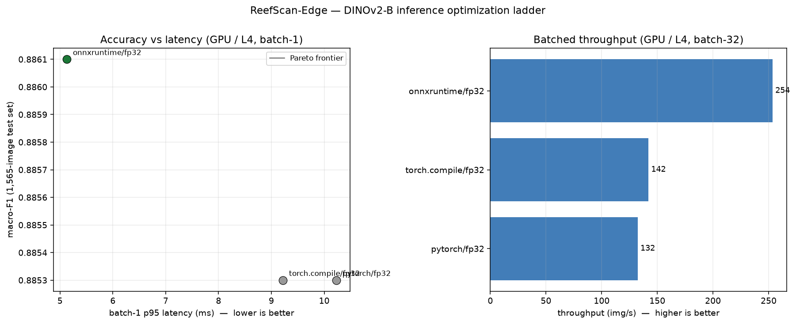
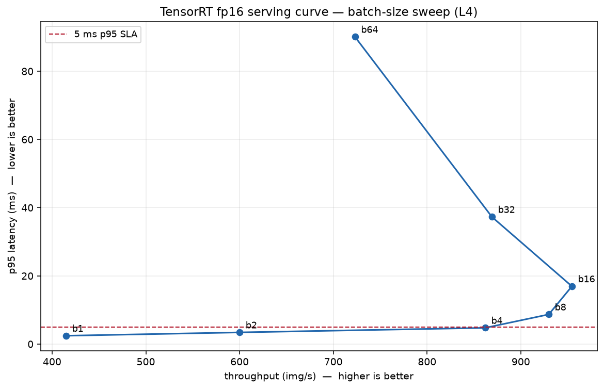

# ReefScan-Edge — inference optimization

> **New here? Start with [`PORTFOLIO.md`](PORTFOLIO.md)** — the complete v2 narrative (this ladder +
> the hand-written C++/TensorRT server + the Triton head-to-head + QAT int8) with résumé bullets.
> This file is the ladder's detailed reference.

An optimization ladder over the trained DINOv2-B coral classifier: map the full
**accuracy–latency frontier** across runtimes (PyTorch → torch.compile → ONNX Runtime →
TensorRT fp16/int8 → Triton) on the **same 1,565-image held-out test set**. Full plan:
[`docs/V2_SPEC.md`](../docs/V2_SPEC.md).

## The result

**TensorRT fp16 wins the ladder: ~2.3 ms batch-1 (63× faster than CPU, 4.3× over the PyTorch-GPU
baseline), ~920 img/s batched (7.2×), at the best accuracy of any variant (macro-F1 0.887) — zero
accuracy cost.** Ship it.

| stage | batch-1 p95 | batched img/s | macro-F1 | note |
|---|---:|---:|---:|---|
| PyTorch fp32 (CPU) | 161 ms | 8 | 0.887 | the starting point |
| PyTorch fp32 (L4) | 10.0 ms | 128 | 0.885 | GPU, but tensor cores idle (TF32 off) |
| torch.compile | 9.1 ms | 140 | 0.885 | launch-bound win |
| ONNX Runtime fp16 | 3.1 ms | 491 | 0.886 | tensor cores, lossless |
| **TensorRT fp16** | **2.3 ms** | **~920** | **0.887** | **champion — fused + autotuned** |
| TensorRT int8 | 2.4 ms | ~900 | 0.884 | recovers ORT's collapse; but dominated by fp16 on Ada |
| ONNX Runtime int8 (CPU) | — | — | **0.399** | naive static PTQ **collapses** (documented negative) |



**Serving economics** (`run_sweep`, TRT fp16, L4 @ $0.80/hr): throughput peaks at **954 img/s @
batch 16** — past that, batching 32/64 makes it *worse* on both axes (the backward-bending curve
below). Cheapest point is **$0.23 per million inferences** (batch 16), ~7× cheaper per image than the
fp32-GPU baseline on the same hardware. Under a 5 ms p95 SLA, batch 4 still delivers 862 img/s.



**What makes this defensible, not just fast:** one harness with enforced invariants (same test set,
warmup+sync timing, batch-1/batched separated, representative int8 calibration); every rung's win
traced to a *reason* (TF32 vs fusion isolated by a control; fp16 lossless; TRT fusion); and **honest
negatives kept in** — naive int8 collapses (0.399), TRT int8 recovers via entropy calibration (0.884)
but is then dominated by fp16 on Ada. Knowing *when not* to use int8 is the point.

## The harness is the spine
`harness.py` defines `benchmark(name, runtime, precision, predict_fn, …)`. Every rung just
registers a new `(runtime, precision, batch)` variant — same timing, same test set, appended
to `results.csv` + `RESULTS.md`. Correctness invariants enforced in `harness.py`:
1. latency = warmup + sync-bracketed timing (device-aware: syncs only on CUDA);
2. macro-F1 on the same fixed test set for every variant;
3. int8 uses `data.load_calibration()` (representative train subsample, not random);
4. batch-1 and batched rows are separate.

## Run
```bash
# from repo root
PYTHONPATH=. python -m edge.run_baseline        # Rung 1 — fp32 baseline (CPU locally, GPU on Colab)
PYTHONPATH=. python -m edge.run_rung2           # Rung 2 — torch.compile (GPU rung; run on Colab)
PYTHONPATH=. python -m edge.run_rung3           # Rung 3 — ONNX export + ONNX Runtime (CUDA EP)
PYTHONPATH=. python -m edge.run_rung3b          # Rung 3b — fp16 + int8 PTQ + TF32 control
PYTHONPATH=. python -m edge.run_rung4           # Rung 4 — TensorRT fp16 + int8 (entropy calib) [GPU only]
PYTHONPATH=. python -m edge.profile_trt         # Profiling — per-layer time of the TRT fp16 engine [GPU only]
PYTHONPATH=. python -m edge.run_sweep           # Serving curve — batch sweep + cost/1k [GPU only]
PYTHONPATH=. python -m edge.plot_pareto         # Pareto frontier -> edge/docs/pareto.png
```
Production serving (Triton + dynamic batching + perf_analyzer): see [`edge/serving/`](serving/) —
needs a GPU+Docker host; `run_sweep` is the Colab-runnable version of the same latency/throughput story.
The Colab notebook `edge/colab/reefscan_edge.ipynb` runs the GPU rungs end-to-end (upload + Run all).
`results.csv` is append-by-replace: re-running a rung overwrites its rows, never duplicates them.

## Rung 4 findings (TensorRT) — the headline
- **TensorRT fp16 wins the whole ladder, on both axes.** batch-1 **2.24 ms** (4.5× over the PyTorch
  fp32 GPU baseline, 63× over CPU), batched **924 img/s** (7.2× over fp32 GPU), and macro-F1 **0.8888**
  — the *best* accuracy of any variant (≥ fp32, within label noise). TRT fuses the whole transformer
  and autotunes kernels for the actual L4.
- **TensorRT int8 recovers the collapse — proving the Rung-3b diagnosis.** ORT static int8 (MinMax)
  cratered to **0.3992** F1; TRT int8 with the **entropy calibrator** lands **0.884** (+0.48 absolute).
  It was the calibration method, not int8 itself — exactly what Rung 3b predicted.
  - *The build log shows why*: TRT emits `Missing scale and zero-point for tensor ...norm... expect
    fall back to non-int8` for every **LayerNorm** — i.e. it automatically keeps the norms in fp16 and
    quantizes only the matmuls. That's the correct transformer-int8 recipe; ORT's naive
    quantize-everything is precisely what broke. (Note: implicit `IInt8EntropyCalibrator2` is
    deprecated in TRT 10.1+ in favor of explicit QDQ quantization — the modern path for future work.)
- **But on the L4, int8 is *dominated* by fp16 — an honest "int8 isn't always worth it."** int8 is the
  same speed as fp16 (2.29 vs 2.24 ms; 903 vs 924 img/s) while giving up ~0.005 F1. On Ada the fp16
  tensor cores already saturate for a model this size, so int8's quant/dequant overhead buys nothing;
  its win would surface on older GPUs (T4), larger models, or memory-bound regimes. **Pareto verdict:
  ship TensorRT fp16.**

## Rung 3b findings (precision)
- **fp16 is the precision win, and it's lossless.** The ONNX graph cast to fp16 (keep_io_types)
  matches ORT-fp32 macro-F1 exactly (0.8861) and is the Pareto-optimal point: batch-1 **3.12 ms p95
  (3.2× over PyTorch fp32)**, **448 img/s batched (3.7×)** — using the tensor cores fp32 leaves idle.
- **The TF32 control resolved the Rung-3 mystery (and corrected my first guess).** Enabling TF32 in
  PyTorch lifted batch-32 throughput 122 → 226 img/s — landing right next to ORT-fp32's 237. So ~all of
  ORT's apparent "fp32" advantage was **TF32 tensor cores** (ORT enables them by default; PyTorch eager
  defaults TF32 *off* for matmul), not ONNX graph magic. BUT TF32 did **not** move accuracy
  (pytorch-tf32 stayed 0.8853, same as strict fp32), so the small 0.8853 → 0.8861 nudge on the ORT rows
  is ORT's fused-kernel numerics (LayerNorm/GELU), independent of TF32 — not the TF32 effect I'd
  speculated at Rung 3.
- **int8 static PTQ collapses this ViT — a documented negative.** Across naive all-op vs MatMul-only
  quantization × MinMax vs Entropy calibration, static int8 lands at ~0.43–0.48 macro-F1 (≈ majority
  class). DINOv2's heavy-tailed activation outliers get squashed by static int8 calibration. The
  viable int8 path is QAT or **TensorRT's int8** (entropy calibrator + int8 tensor-core kernels) —
  Rung 4. Recorded as a measured row, not hidden.

## Phases (spec §6)
- **Weekend 1:** Rung 1 baseline (this) → Rungs 2–3 (torch.compile, ONNX) → Rung 3b (fp16 + int8 PTQ, first Pareto plot).
- **Weekend 2:** Rung 4 TensorRT (fp16 + int8) → Rung 5–6 Triton + perf_analyzer + cost/1k → profiling + Pareto report.
- **Optional:** Rung 7 distillation; CoreML / C++ TensorRT runtime.

## Pinned versions
CPU/scaffolding deps: see `requirements.txt`. GPU rung versions (CUDA / TensorRT / torch-cuda /
onnxruntime-gpu) are pinned in the per-rung Colab cell blocks and recorded here as each lands —
TensorRT/CUDA mismatches waste hours, so the GPU rungs run in the NGC containers
(`nvcr.io/nvidia/pytorch:<tag>`, `nvcr.io/nvidia/tritonserver:<tag>-py3`).

| rung | versions (filled per phase) |
|---|---|
| 1 PyTorch fp32 | torch 2.4.1 — local CPU verify + Colab **L4** (torch 2.4.1+cu121) |
| 2 torch.compile | torch 2.4.1 Inductor, `mode=max-autotune` — Colab L4 (cu121) |
| 3 ONNX Runtime | onnx 1.16.2, opset 17 (dynamic batch); onnxruntime-gpu 1.19.2 CUDA EP (cuDNN 9 via torch's bundled libs) — Colab L4 |
| 3b fp16 + int8 | onnxconverter-common 1.14.0 (fp16, needs numpy<2); ORT static int8 PTQ (QDQ, per-channel), calib = `load_calibration()` — Colab L4 |
| 4 TensorRT | tensorrt 10.5.0 (cu12) Python API; fp16 + int8 (IInt8EntropyCalibrator2, calib = `load_calibration()`) — Colab L4 |
